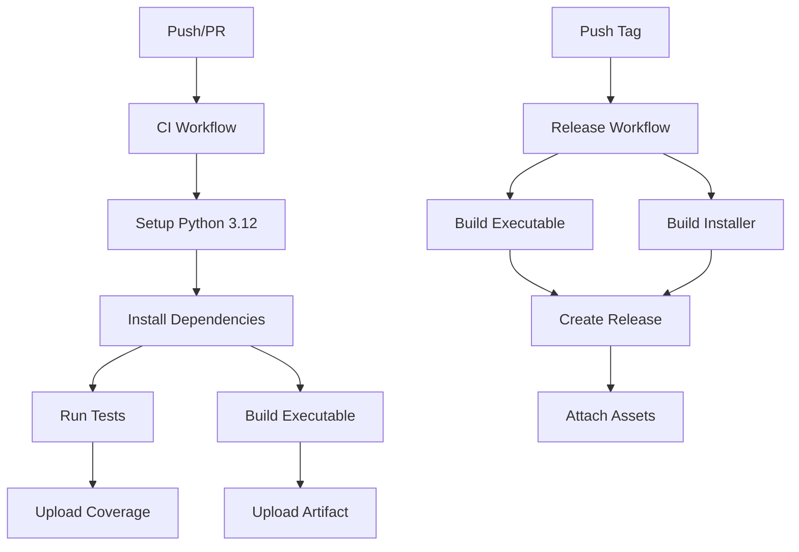

# Design Document: GitHub Actions CI/CD

## Overview

This design implements a comprehensive GitHub Actions CI/CD pipeline for Scanner-Watcher2, providing automated building, testing, and releasing of the Windows application. The solution uses GitHub's native CI/CD platform with workflows defined as YAML files stored in the repository, following the infrastructure-as-code pattern similar to Bamboo Specs.

The design includes four primary workflows:
1. **CI Workflow**: Runs tests and builds on every push/PR
2. **Build Workflow**: Creates the PyInstaller executable
3. **Installer Workflow**: Generates the Inno Setup installer
4. **Release Workflow**: Automates version releases with downloadable assets

## Architecture

### Workflow Organization

```
.github/
└── workflows/
    ├── ci.yml              # Main CI workflow (test + build)
    ├── release.yml         # Release automation workflow
    └── README.md           # Workflow documentation
```

### Workflow Execution Flow



### Runner Selection

- **Primary Runner**: `windows-latest` (currently Windows Server 2022)
- **Python Version**: 3.12 (matches development environment)
- **Fallback Strategy**: Pin to `windows-2022` if `windows-latest` causes issues

## Components and Interfaces

### 1. CI Workflow (`ci.yml`)

**Purpose**: Validate code quality on every commit and pull request

**Triggers**:
- Push to `main` branch
- Pull request to `main` branch
- Manual dispatch via GitHub UI

**Jobs**:

#### Job: Test
- Sets up Python 3.12 on Windows runner
- Installs dependencies from `pyproject.toml`
- Runs pytest with coverage
- Uploads coverage reports as artifacts
- Fails workflow if tests fail

#### Job: Build
- Depends on test job passing
- Sets up Python 3.12 on Windows runner
- Installs dependencies including PyInstaller
- Executes `pyinstaller scanner_watcher2.spec`
- Uploads executable as artifact
- Validates executable was created

**Outputs**:
- Test coverage reports (HTML and XML)
- Standalone executable (`ScannerWatcher2.exe`)

### 2. Release Workflow (`release.yml`)

**Purpose**: Automate creation of GitHub releases with installers

**Triggers**:
- Push of tags matching `v*.*.*` pattern (e.g., `v1.0.0`)
- Manual dispatch with version input

**Jobs**:

#### Job: Build-Release
- Sets up Python 3.12 on Windows runner
- Installs all dependencies
- Builds PyInstaller executable
- Installs Inno Setup via Chocolatey
- Compiles Inno Setup installer
- Creates GitHub release
- Uploads installer as release asset

**Outputs**:
- GitHub release with version tag
- Downloadable installer (`ScannerWatcher2Setup.exe`)

### 3. Workflow Actions Used

**Official Actions**:
- `actions/checkout@v4`: Clone repository
- `actions/setup-python@v5`: Install Python runtime
- `actions/upload-artifact@v4`: Store build outputs
- `actions/download-artifact@v4`: Retrieve artifacts between jobs
- `softprops/action-gh-release@v1`: Create GitHub releases

**Windows-Specific Tools**:
- Chocolatey: Package manager for installing Inno Setup
- PyInstaller: Bundled via pip, no special installation

## Data Models

### Workflow Configuration Structure

```yaml
name: Workflow Name
on: [triggers]
jobs:
  job-name:
    runs-on: windows-latest
    steps:
      - name: Step Name
        uses: action@version
        with:
          parameter: value
```

### Artifact Structure

```
artifacts/
├── executable/
│   └── ScannerWatcher2.exe
├── installer/
│   └── ScannerWatcher2Setup.exe
└── coverage/
    ├── htmlcov/
    └── coverage.xml
```

### Release Asset Naming

- Executable: `ScannerWatcher2-{version}-windows.exe`
- Installer: `ScannerWatcher2Setup-{version}.exe`
- Version format: `v1.0.0` (semantic versioning)

## 
Correctness Properties

*A property is a characteristic or behavior that should hold true across all valid executions of a system-essentially, a formal statement about what the system should do. Properties serve as the bridge between human-readable specifications and machine-verifiable correctness guarantees.*

**Note on Testability**: This feature involves creating GitHub Actions workflow configuration files (YAML) that define CI/CD pipelines. The acceptance criteria primarily describe GitHub Actions' built-in behaviors (triggering workflows, running jobs, uploading artifacts, creating releases) rather than custom code logic that we implement.

Since we are creating configuration files rather than implementing runtime logic, there are no universal properties to test via property-based testing. The correctness of this feature is validated through:

1. **Structural validation**: YAML syntax correctness
2. **Integration testing**: Running the workflows on GitHub Actions
3. **Manual verification**: Confirming workflows execute as expected

Therefore, this feature has **no testable correctness properties** in the property-based testing sense. The validation approach will rely on integration testing with actual GitHub Actions execution.

## Error Handling

### Workflow Failure Scenarios

**Build Failures**:
- **Cause**: PyInstaller fails to create executable
- **Handling**: Workflow fails, logs show PyInstaller error output
- **Recovery**: Developer fixes code/spec file, pushes new commit

**Test Failures**:
- **Cause**: Pytest tests fail on Windows runner
- **Handling**: Workflow fails, prevents PR merge, uploads partial coverage
- **Recovery**: Developer fixes failing tests, pushes new commit

**Installer Compilation Failures**:
- **Cause**: Inno Setup compilation errors
- **Handling**: Workflow fails, logs show Inno Setup compiler output
- **Recovery**: Developer fixes .iss file, re-runs workflow

**Dependency Installation Failures**:
- **Cause**: pip fails to install packages (network issues, version conflicts)
- **Handling**: Workflow fails at dependency installation step
- **Recovery**: Automatic retry by re-running workflow, or fix dependency specifications

**Release Creation Failures**:
- **Cause**: GitHub API errors, missing permissions, duplicate tag
- **Handling**: Workflow fails, error message indicates cause
- **Recovery**: Fix permissions/tag issues, re-run workflow

### Timeout Configuration

- **Default job timeout**: 60 minutes (GitHub Actions default)
- **Expected durations**:
  - Test job: 5-10 minutes
  - Build job: 10-15 minutes
  - Release job: 15-20 minutes
- **Timeout strategy**: Use default, adjust if jobs consistently approach limit

### Retry Strategy

- **Automatic retries**: None (GitHub Actions doesn't auto-retry by default)
- **Manual retry**: Re-run failed jobs via GitHub UI
- **Transient failure handling**: Developers can re-run individual failed jobs

## Testing Strategy

### Workflow Validation

**YAML Syntax Validation**:
- Use `yamllint` or GitHub's workflow validator
- Validate before committing workflow files
- GitHub provides syntax checking in the Actions tab

**Local Testing**:
- Use `act` tool to run GitHub Actions locally (limited Windows support)
- Test individual build/test commands locally before adding to workflows
- Validate PyInstaller and Inno Setup commands work on Windows

### Integration Testing

**CI Workflow Testing**:
- Create test branch and push to trigger workflow
- Verify all jobs complete successfully
- Check artifacts are uploaded correctly
- Validate test coverage reports are generated

**Release Workflow Testing**:
- Create test tag (e.g., `v0.0.1-test`)
- Verify release is created with correct assets
- Download and test installer from release
- Delete test release after validation

**Pull Request Testing**:
- Create PR with workflow changes
- Verify status checks appear on PR
- Confirm workflow runs on PR commits
- Validate merge blocking on test failures

### Validation Checklist

Before considering workflows production-ready:

- [ ] CI workflow runs successfully on main branch
- [ ] Tests execute and pass on Windows runner
- [ ] Coverage reports are generated and uploaded
- [ ] PyInstaller executable is created and uploaded
- [ ] Release workflow creates GitHub release
- [ ] Installer is attached to release as asset
- [ ] Installer downloads and installs correctly
- [ ] Workflow status badges appear on PRs
- [ ] Failed workflows block PR merging
- [ ] Workflow logs provide useful debugging information

### No Property-Based Testing

As identified in the Correctness Properties section, this feature does not require property-based testing because:
- We are creating configuration files, not implementing algorithms
- The behavior is defined by GitHub Actions, not our code
- Validation is achieved through integration testing with actual workflow execution

### No Unit Testing

Similarly, traditional unit testing is not applicable because:
- YAML configuration files don't contain testable code logic
- The "units" are GitHub Actions' built-in features
- Correctness is validated by running workflows on GitHub's infrastructure

## Implementation Notes

### Secrets Management

**Required Secrets**:
- `GITHUB_TOKEN`: Automatically provided by GitHub Actions (no setup needed)
- Future: `OPENAI_API_KEY` if running integration tests that call OpenAI API

**Secret Configuration**:
- Secrets configured in repository settings: Settings → Secrets and variables → Actions
- Referenced in workflows as `${{ secrets.SECRET_NAME }}`
- Never logged or exposed in workflow output

### Caching Strategy

**Python Dependencies**:
```yaml
- uses: actions/cache@v4
  with:
    path: ~\AppData\Local\pip\Cache
    key: ${{ runner.os }}-pip-${{ hashFiles('pyproject.toml') }}
```

**Benefits**:
- Faster workflow execution (skip re-downloading packages)
- Reduced network usage
- More reliable builds (less dependent on PyPI availability)

### Artifact Retention

- **Default retention**: 90 days (GitHub Actions default)
- **Recommendation**: Keep default for CI artifacts, releases are permanent
- **Storage considerations**: Artifacts count against repository storage quota

### Workflow Permissions

**Required permissions** (configured in workflow YAML):
- `contents: write` - For creating releases and uploading assets
- `pull-requests: read` - For PR status checks

**Security considerations**:
- Use minimal required permissions
- Avoid `write-all` permissions
- Review permissions when adding new actions

### Windows-Specific Considerations

**Path Separators**:
- Use forward slashes in workflow YAML (GitHub Actions normalizes)
- PowerShell commands handle both `/` and `\`

**Line Endings**:
- Git should handle CRLF/LF conversion automatically
- Ensure `.gitattributes` is configured correctly

**Chocolatey Installation**:
- Pre-installed on GitHub's Windows runners
- Use `choco install` for additional tools like Inno Setup

**PyInstaller on Windows**:
- Works natively on Windows runners
- No special configuration needed beyond the .spec file
- Ensure all dependencies are included in spec file

## Future Enhancements

### Potential Additions

1. **Code Quality Checks**:
   - Add `black`, `ruff`, `mypy` to CI workflow
   - Fail workflow on linting/formatting issues

2. **Security Scanning**:
   - Add dependency vulnerability scanning (e.g., `pip-audit`)
   - Scan for secrets accidentally committed

3. **Performance Testing**:
   - Add benchmarks to track performance over time
   - Fail if performance regresses significantly

4. **Multi-Version Testing**:
   - Test on multiple Windows versions (2019, 2022)
   - Test with multiple Python versions (3.12, 3.13)

5. **Automated Changelog**:
   - Generate changelog from commit messages
   - Include in release notes

6. **Notification Integration**:
   - Send notifications on workflow failures
   - Integrate with Slack, email, or other services

### Maintenance Considerations

- **Action Version Updates**: Regularly update action versions (e.g., `@v4` → `@v5`)
- **Runner Updates**: Monitor GitHub's runner image updates for breaking changes
- **Dependency Updates**: Keep Python dependencies up to date
- **Workflow Optimization**: Profile and optimize slow workflows
